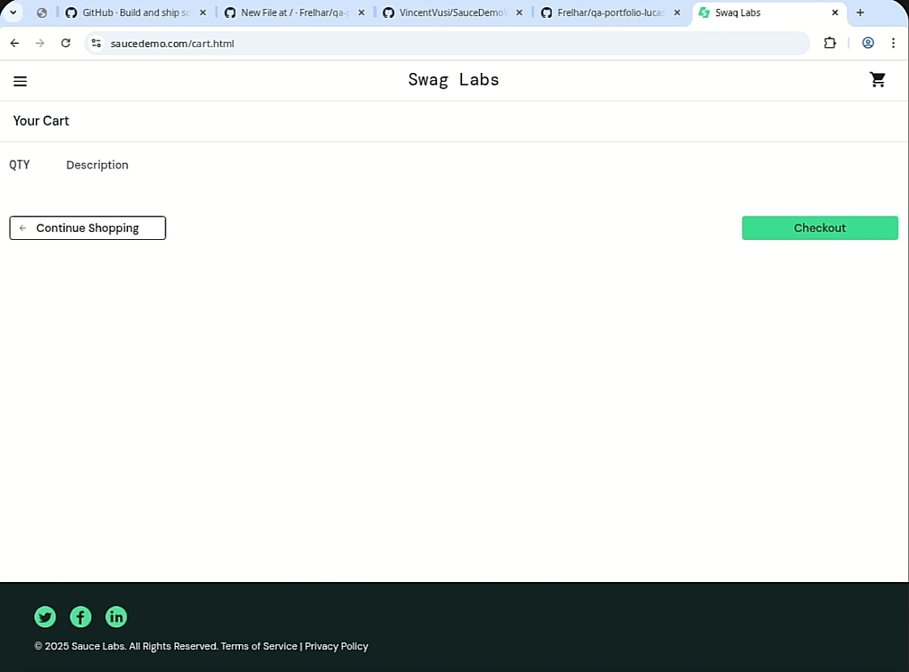

# Relatório de Bug - Checkout habilitado com carrinho vazio

**ID:** BUG-CART-001
**Data:** 2025-08-19
**Reporter:** Lucas Müller
**Ambiente:** Chrome 130 / Windows
**URL:** https://www.saucedemo.com/cart.html

**Descrição:** O fluxo de checkout está disponível mesmo quando o carrinho está vazio.

## Pré-condições
- Usuário autenticado no site.
- Carrinho sem itens.

## Passos para reproduzir
1. Acessar https://www.saucedemo.com/ e fazer login com usuário válido.
2. Não adicionar nenhum item ao carrinho.
3. Clicar no ícone do carrinho no canto superior direito.
4. Clicar no botão **Checkout**.

## Resultado esperado
O botão de checkout deve estar desabilitado ou o sistema deve mostrar mensagem solicitando ao usuário que adicione itens ao carrinho antes de prosseguir.

## Resultado obtido
A página de checkout é carregada normalmente mesmo com carrinho vazio.

## Evidências

## Observações
Verificar se este comportamento é esperado pelos requisitos. Se não, ajustar a validação do carrinho para impedir avanço sem itens.
